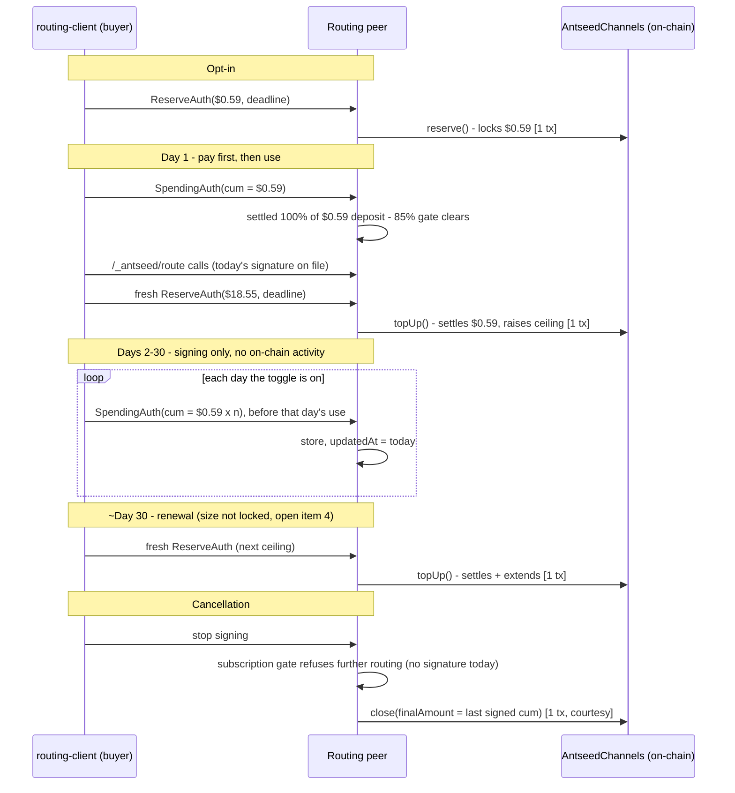

# Model Routing — Payment Flow

**Ground truth:** `docs/model-routing-architecture-and-open-decisions.md` §6 and open items 1–4. Companion to `docs/model-routing-software-architecture.md` §2.6/§3.3. This doc exists because the payment mechanism has real moving parts across four actors and two chains of trust (off-chain signing, on-chain settlement) — organized here by actor and by on/off-chain boundary rather than chronologically, since that's what actually makes it legible.

---

## Actors

| Actor | What it is | Role in payments |
|---|---|---|
| `routing-client` plugin | Buyer-side code, loaded into the VPR/CLI process | Owns 100% of the *decision* — when to sign, how much, the bootstrap ramp, the catch-up window. Never touches a key directly. |
| `BuyerPaymentManager` | AntSeed's own host code, same process as the plugin | Owns the *cryptographic operation* and its bookkeeping — holds the real signing key, does the actual signing, updates internal state `_needsTopUp()` depends on. |
| `routing-server` plugin + `SellerPaymentManager` | Levanto's routing peer | Receives signatures over `PaymentMux`, stores them, gates `/_antseed/route` on today's signature being on file, decides when to submit on-chain. |
| Base L2 (`AntseedChannels`, `AntseedDeposits`) | Shared blockchain, external to everyone | Where locked funds and settlement actually live. Nobody but the seller (routing peer) pays gas for channel lifecycle calls. |

---

## The two authorizations

Two different off-chain signatures, doing two different jobs — this is the single most common point of confusion, worth stating plainly:

| | `ReserveAuth` | `SpendingAuth` |
|---|---|---|
| Authorizes | **Locking** funds into the channel | **Spending** funds already locked |
| Sets | A ceiling | A cumulative running total, monotonic |
| Expires | Yes — carries a deadline | No deadline, no nonce — a signature for a higher amount is valid forever until settled |
| Consumed by | `reserve()`, `topUp()` | `settle()`, `topUp()`, `close()` |
| Signed... | Once at opt-in, then roughly monthly | Once per calendar day, before that day's use |

---

## On-chain vs. off-chain

The vast majority of activity is off-chain signing. On-chain calls are rare, seller-paid, and batched — this is the design's actual point.

| Event | Where | Who pays gas | Frequency |
|---|---|---|---|
| Sign `SpendingAuth` for today | Off-chain (over `PaymentMux`) | Nobody — free | Once per calendar day the toggle is on |
| Sign `ReserveAuth` for the next ceiling | Off-chain | Nobody — free | Once at opt-in, then ~monthly |
| `reserve()` — opens the channel | **On-chain** | Routing peer | Once, at opt-in |
| `topUp()` — settles pending spend + raises ceiling, atomically | **On-chain** | Routing peer | Once right after the bootstrap day, then ~monthly |
| `close()` — final settlement | **On-chain** | Routing peer | Once, at cancellation (courtesy) |
| `requestClose()` → `withdraw()` | **On-chain** | Buyer | Only if the peer goes unresponsive — 15-minute grace period, buyer's own escape hatch |
| Deposit / withdraw custody balance | **On-chain** | Buyer | Whenever the buyer funds or reclaims their own AntSeed balance — separate from this channel entirely |

Result: the one-time bootstrap is cheap — `reserve()` plus one `topUp()`, 2 transactions total, ever. But `topUp()` then recurs roughly **monthly** for as long as the subscription stays active — so the actual steady-state rate is **~12 transactions per subscriber per year** (§6.4's own table and §10's unit economics both state this directly), not a one-off cost. Year one is closer to 13–14 once `reserve()` is counted; an eventual `close()` adds one more, whenever that happens. Everything else — the daily `SpendingAuth` signing — is free and off-chain.

---

## Lifecycle

Why the $0.59 bootstrap, not $1.00: `reserve()` is capped at `FIRST_SIGN_CAP` ($1.00) for every AntSeed channel, no exceptions. `topUp()` only unlocks once 85% of the current deposit is settled. Reserve the max $1.00 and day 1's $0.59 signature only clears 59% — a second day is needed. Reserve exactly $0.59 instead and day 1's signature settles 100% of it, clearing the gate a full day sooner.

---

## What already exists (no new AntSeed protocol or contracts)

- The channel primitives themselves — `ReserveAuth`, `SpendingAuth`, `reserve()`/`topUp()`/`settle()`/`close()`/`requestClose()`/`withdraw()`. All pre-existing, generic to any seller.
- `PaymentMux` + `SellerPaymentManager.handleSpendingAuth()` — the transport and server-side bookkeeping for receiving signatures, decoupled from any HTTP request. Already generic, not provider-specific.
- `BuyerPaymentManager`'s silent-signing infrastructure — zero popups or confirmation dialogs anywhere today, for either signature type. The proactive top-up trigger `_needsTopUp()` (firing at 65% of ceiling) is reused **unmodified**.
- `hasSession(buyerPeerId)` / `getChannelByPeer(buyerPeerId)` on `SellerPaymentManager` — already exist, already generic; `StoredChannel.updatedAt` is already bumped on every committed signature. The subscription gate is built entirely from existing reads, no new storage.

## What needs building, and why

| Item | Why it's needed |
|---|---|
| New narrow `BuyerPaymentManager` method (decisions doc open item 2) | `signPerRequestAuth`, the only existing signing entry point, computes cost from a real completed request's usage data — there's no way to hand it a flat externally-decided amount without faking response data. A narrower method does just the sign/persist/bookkeeping tail, given an amount the plugin already decided. |
| Per-seller top-up increment override (open item 1) | `topUpReserve()`'s increment defaults to $1.00, buyer-wide. Left unchanged, the routing channel would grow $1 at a time forever instead of settling into a monthly ~$18 cadence — reopening the exact gas problem the monthly design avoids. |
| `routing-client`'s signing-decision logic | Entirely new plugin code: pay-first calendar-day cadence, the bootstrap ramp sequencing, the ~30-day catch-up cap, cancellation. Built on top of the existing primitives above, not replacing them. |
| `routing-server`'s subscription gate | New, but small — a few lines combining two already-existing `SellerPaymentManager` reads, gating `/_antseed/route` before the expensive Sage call runs. |
| Gas measurement on Base (open item 3) | Empirical, not code — needed before the monthly cadence (open item 4) is locked in. |

---

## Still open

See decisions doc §13 items 1–4 — all payment-mechanics questions, none of them touch the signing/gating design above:

1. `maxReserveAmountUsdc` override wiring (per-seller config vs. a scoped `BuyerPaymentManager` instance).
2. The narrow signing method itself needs building.
3. `topUp` gas cost on Base, not yet measured.
4. Whether the post-bootstrap ceiling should jump straight to a full month, or ramp up more gradually.
