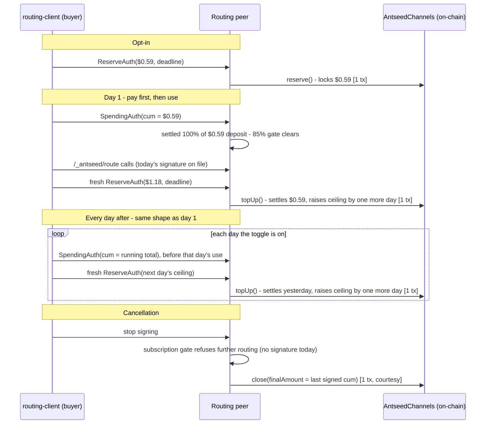
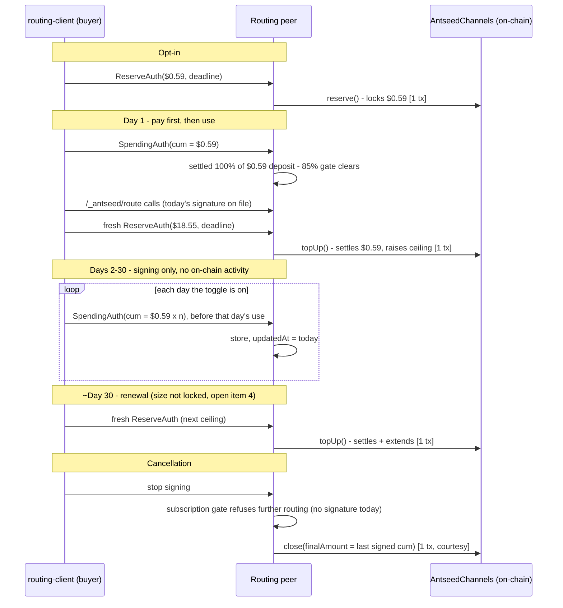

# Model Routing — Payment Flow

**Ground truth:** `docs/model-routing-architecture-and-open-decisions.md` §6 and open items 1–4. Companion to `docs/model-routing-software-architecture.md` §2.6/§3.3. This doc exists because the payment mechanism has real moving parts across four actors and two chains of trust (off-chain signing, on-chain settlement) — organized here by actor and by on/off-chain boundary rather than chronologically, since that's what actually makes it legible.

---

## Actors

| Actor | What it is | Role in payments |
|---|---|---|
| `routing-client` plugin | Buyer-side code, loaded into the VPR/CLI process | Owns 100% of the *decision* — when to sign, how much, the bootstrap ramp, the catch-up backlog, cancellation. Never touches a key directly. |
| `BuyerPaymentManager` | AntSeed's own host code, same process as the plugin | Owns the *cryptographic operation* and its bookkeeping — holds the real signing key, does the actual signing, updates internal state `_needsTopUp()` depends on. |
| `routing-server` plugin + `SellerPaymentManager` | Levanto's routing peer | Receives signatures over `PaymentMux`, stores them, gates `/_antseed/route` on today's signature being on file, decides when to submit on-chain. |
| Base L2 (`AntseedChannels`, `AntseedDeposits`) | Shared blockchain, external to everyone | Where locked funds and settlement actually live. Nobody but the seller (routing peer) pays gas for channel lifecycle calls. |

---

## The two authorizations

Two different off-chain signatures, doing two different jobs — this is the single most common point of confusion, worth stating plainly:

| | `ReserveAuth` | `SpendingAuth` |
|---|---|---|
| Authorizes | **Locking** funds into the channel | **Spending** funds already locked |
| Sets | A ceiling | A cumulative running total, monotonic |
| Expires | Yes — carries a deadline | No deadline, no nonce — a signature for a higher amount is valid forever until settled |
| Consumed by | `reserve()`, `topUp()` | `settle()`, `topUp()`, `close()` |
| Signed... | Once at opt-in, then daily by default (~monthly if the alternative below is chosen) | Once per calendar day, before that day's use |

---

## On-chain vs. off-chain

Signing is always off-chain and free. On-chain calls are always seller-paid; how *often* they happen is the one thing still open (decisions doc item 4) — daily is the working default, described below, with monthly as the fallback if measured gas doesn't support it.

| Event | Where | Who pays gas | Frequency |
|---|---|---|---|
| Sign `SpendingAuth` for today | Off-chain (over `PaymentMux`) | Nobody — free | Once per calendar day the toggle is on |
| Sign `ReserveAuth` for the next ceiling | Off-chain | Nobody — free | Daily by default, paired with each day's `topUp()`; ~monthly if the alternative below is chosen instead |
| `reserve()` — opens the channel | **On-chain** | Routing peer | Once, at opt-in |
| `topUp()` — settles pending spend + raises ceiling, atomically | **On-chain** | Routing peer | Daily by default — every day is a bootstrap day, forever (§ Lifecycle below); ~monthly if the alternative is chosen instead |
| `close()` — final settlement | **On-chain** | Routing peer | Once, at cancellation (courtesy) |
| `requestClose()` → `withdraw()` | **On-chain** | Buyer | The buyer's own mechanism to exit and reclaim locked funds promptly — not just a peer-unresponsive fallback. Just stopping signing leaves the channel open indefinitely, since the seller has no urgency to close it (past earnings are already safe either way); `requestClose()` forces the issue, opening a 15-minute grace window before `withdraw()` sweeps whatever's still unsettled |
| Deposit / withdraw custody balance | **On-chain** | Buyer | Whenever the buyer funds or reclaims their own AntSeed balance — separate from this channel entirely |

Result: the daily default has no separate bootstrap phase to reason about — `topUp()` does exactly the same thing every day, forever, so the steady-state rate is **~365 transactions per subscriber per year**, all seller-paid (§6.4's table). The monthly alternative trades that uniformity for far less gas — a one-time bootstrap (`reserve()` plus one `topUp()`, 2 transactions, ever), then **~12 `topUp()`s/year** instead of 365 — at the cost of a real mechanism distinction between the bootstrap day and steady state, and higher average blocked buyer capital (~$9 vs. ~$0.30). Everything else — the daily `SpendingAuth` signing — is free and off-chain either way.

---

## Lifecycle

Default cadence: daily. Every day is a bootstrap day, forever — there's no separate "ramp, then settle into a different rhythm" to reason about, and every day after opt-in looks exactly like the one before it.

Why the $0.59 bootstrap, not $1.00: `reserve()` is capped at `FIRST_SIGN_CAP` ($1.00) for every AntSeed channel, no exceptions. `topUp()` only unlocks once 85% of the current deposit is settled. Reserve the max $1.00 and day 1's $0.59 signature only clears 59% — a second day is needed. Reserve exactly $0.59 instead and day 1's signature settles 100% of it, clearing the gate a full day sooner.

**Catch-up.** Billing tracks the toggle, not activity — a day is owed whenever the toggle was on, whether or not the app was even open. So the only free days are ones where the toggle was explicitly switched off in settings; a buyer who leaves the toggle on but has the app closed (or the device off) for a stretch comes back owing a real backlog, capped at ~30 toggle-on days, with anything older forgiven. Settling that backlog under the daily default takes exactly two on-chain calls, both seller-paid — necessary because `topUp()` checks the submitted cumulative against the *current* (pre-raise) ceiling before applying the raise (`AntseedChannels.sol:224`), so a backlog bigger than today's small ceiling can't be settled in the same call that raises it:

1. `topUp()` — raises the ceiling straight to `backlogCumulative + $0.59`, landing back at the normal steady state. The 85% settled-threshold gate is already satisfied for free, since the small pre-gap ceiling was already ~100% settled by routine operation.
2. `settle()` — submits the actual backlog `SpendingAuth`, now that the raised ceiling covers it.

Mechanically this is the bootstrap ramp again (small step, then one larger jump), just triggered by a reconnect instead of day 1, bounded to at most ~$18.55 by the 30-day cap — about the same size as monthly's own ceiling. Routing stays refused until it completes, same as before day 1's first signature. This is a real cost daily carries that monthly mostly avoids: monthly's pre-loaded ~30-day ceiling usually absorbs a mid-cycle gap silently, needing this same two-call mechanism only if the gap runs past its own ceiling and hits its own cap.

**Buyer closes early.** If the buyer calls `requestClose()` instead of just going quiet, the contract's own grace period exists specifically so the seller can still claim what it's owed: `settle()`/`close()` remain callable for 15 minutes after the request, using the *latest* signed cumulative — not "all" the signatures ever given, since each new one supersedes the last, so there's only ever one number to submit. Only after that window does `withdraw()` become callable, sweeping whatever's still unsettled back to the buyer. This already works end-to-end with no new code (see below).

---

## Alternative considered: monthly `topUp()` instead of daily

Same mechanism, different cadence — one bootstrap day followed by a monthly rhythm, instead of every day being a bootstrap day forever. This is the leading fallback if measured Base gas (item 3) makes daily's ~$0.006/tx budget implausible (decisions doc item 4).

Extending the same table §6.4 uses to compare cadences:

| Reserve period | Ceiling | Avg blocked | On-chain txs/user/yr | Gas budget per tx to stay under 1% of revenue |
|---|---|---|---|---|
| 1 day (default) | $0.59 | ~$0.30 | ~365 | ~$0.006 |
| ~2 days | $1.18 | $0.59 | ~182 | $0.012 |
| **1 month** | **$17.96** | **~$9** | **~12** | **$0.18** |

Monthly needs gas to stay under a much more forgiving $0.18/tx instead of daily's ~half a cent, for a call §6.4 already describes as "heavy: two ECDSA recoveries, a USDC transfer, several storage writes." Both cadences need the same ~30-toggle-on-day catch-up cap (Lifecycle above) — it's a backlog-billing rule, not a ceiling-sizing one — but monthly needs it far less often: a subscriber who's used the router for only a few days of a mostly-idle month already has a full month's ceiling ($17.96) sitting reserved, so an ordinary gap is absorbed silently, with the two-call catch-up mechanism only triggering if the gap runs long enough to exceed even that ceiling. Daily's ceiling tracks actual use far more tightly, so it hits the catch-up path on essentially any multi-day gap. Monthly's real advantage is gas — 12 tx/year instead of 365 — and, secondarily, a natural checkpoint for a visible "renewed your subscription" notice that daily's uniform cadence doesn't have (decisions doc §6.6, R17).

---

## What already exists (no new AntSeed protocol or contracts)

- The channel primitives themselves — `ReserveAuth`, `SpendingAuth`, `reserve()`/`topUp()`/`settle()`/`close()`/`requestClose()`/`withdraw()`. All pre-existing, generic to any seller.
- **Reacting to an early buyer close** — `SellerPaymentManager.handleCloseRequested()` (`seller-payment-manager.ts:1722-1751`) already does exactly the right thing: on a `CloseRequested` event, reads its own stored latest accepted cumulative for that channel and calls `close()` with it immediately, before the grace period expires; if it's holding nothing, it cleans up locally rather than attempting a false claim. `pollCloseRequested()` watches for the event and dispatches into this automatically. Fully generic — this problem predates the routing peer's design entirely, and `routing-server` inherits it for free by sitting on an ordinary AntSeed seller node underneath. Nothing to build here.
- `PaymentMux` + `SellerPaymentManager.handleSpendingAuth()` — the transport and server-side bookkeeping for receiving signatures, decoupled from any HTTP request. Already generic, not provider-specific.
- `BuyerPaymentManager`'s silent-signing infrastructure — zero popups or confirmation dialogs anywhere today, for either signature type. The proactive top-up trigger `_needsTopUp()` (firing at 65% of ceiling) is reused **unmodified**.
- `hasSession(buyerPeerId)` / `getChannelByPeer(buyerPeerId)` on `SellerPaymentManager` — already exist, already generic; `StoredChannel.updatedAt` is already bumped on every committed signature. The subscription gate is built entirely from existing reads, no new storage.

## What needs building, and why

| Item | Why it's needed |
|---|---|
| New narrow `BuyerPaymentManager` method (decisions doc open item 2) | `signPerRequestAuth`, the only existing signing entry point, computes cost from a real completed request's usage data — there's no way to hand it a flat externally-decided amount without faking response data. A narrower method does just the sign/persist/bookkeeping tail, given an amount the plugin already decided. |
| Per-seller top-up increment override (open item 1) | Not needed under the daily default — `topUpReserve()`'s $1.00 buyer-wide default already comfortably covers the $0.59/day increment. Only becomes necessary if the monthly alternative is chosen instead, where the needed increment is ~$18. |
| `routing-client`'s signing-decision logic | Entirely new plugin code: pay-first calendar-day cadence, the bootstrap ramp sequencing, cancellation, and the toggle-on-gap catch-up burst — tracking toggle on/off transitions locally, computing the capped backlog, and driving the two-call catch-up sequence on reconnect (see Lifecycle above). |
| `routing-server`'s subscription gate | New, but small — a few lines combining two already-existing `SellerPaymentManager` reads, gating `/_antseed/route` before the expensive Sage call runs. |
| Gas measurement on Base (open item 3) | Empirical, not code — needed before daily vs. monthly (open item 4) is locked in either direction. |

---

## Still open

See decisions doc §13 items 1–4 — all payment-mechanics questions, none of them touch the signing/gating design above:

1. `maxReserveAmountUsdc` override wiring — only relevant if monthly is chosen over the daily default (per-seller config vs. a scoped `BuyerPaymentManager` instance).
2. The narrow signing method itself needs building.
3. `topUp` gas cost on Base, not yet measured — this is what would confirm or overturn daily as the default.
4. Daily (default) vs. monthly reserve cadence, not locked either way; if monthly is chosen, its own sizing question resurfaces — jump straight to a full month's ceiling, or ramp up more gradually.
