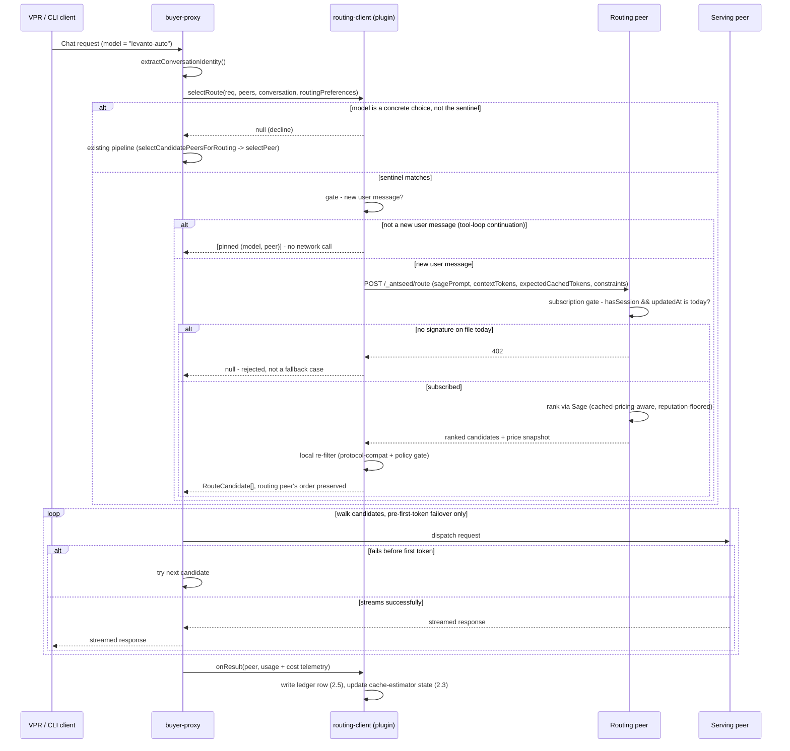
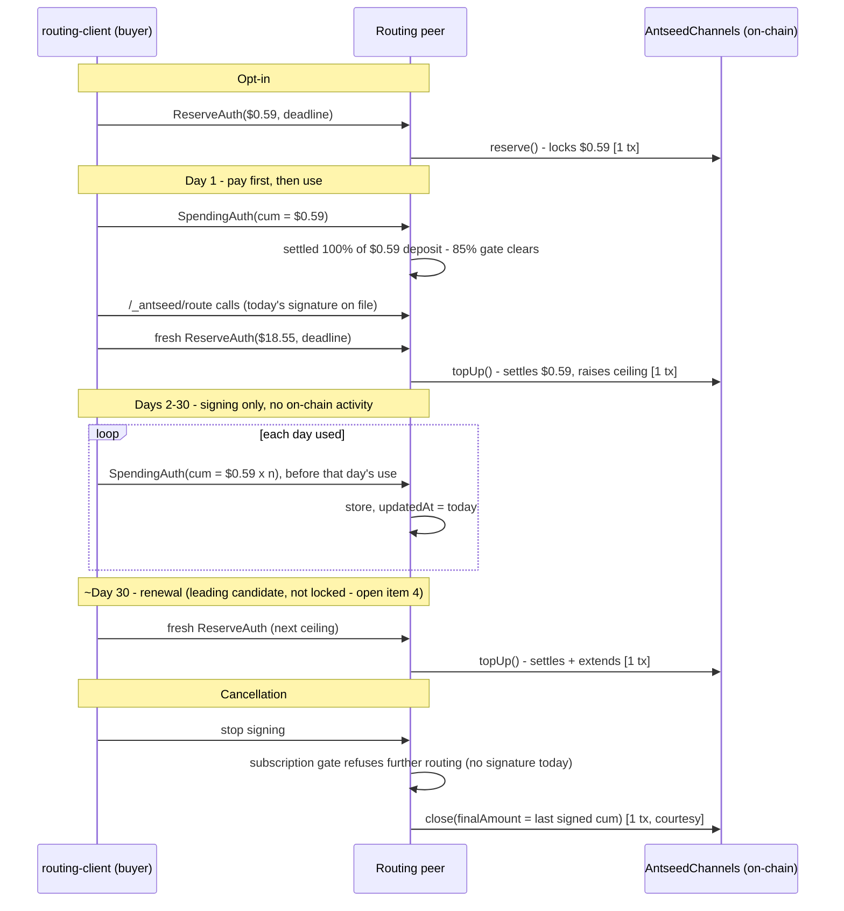

# Model Routing — Software Architecture

**Ground truth:** `docs/model-routing-architecture-and-open-decisions.md`. This doc breaks that design down into components, ownership, and interfaces — it does not reopen any decision made there.

---

## 1. AntSeed Platform Prerequisites

- **Wire `selectRoute` into buyer-proxy's request path.** Call the router's optional `selectRoute` unconditionally, before the existing `selectCandidatePeersForRouting` narrowing, whenever the registered router implements it. If it resolves `null`, or the router doesn't implement it, fall through to the unmodified existing pipeline (`selectCandidatePeersForRouting` → `selectPeer`). Host code needs no knowledge of any sentinel string — that's entirely the plugin's business.
- **Pass the already-computed `ConversationIdentity` into `selectRoute`.** Buyer-proxy already calls `extractConversationIdentity(headers, body)` (`apps/cli/src/proxy/conversation-identity.ts`) before candidate-narrowing runs. Thread that result straight into `selectRoute` rather than making the plugin re-derive tool/session identity from raw headers — that logic (per-tool session header conventions, title-request filtering, synthetic fallback) stays owned in one place.
- **Declare `selectRoute` as a formal optional method on the `Router` interface** (`packages/node/src/interfaces/buyer-router.ts`), and export the `RouteCandidate` type (§2.1) from wherever both buyer-proxy and plugins can import it. Not just a wiring change — the type itself doesn't exist yet.
- **Skip the local `rankModelRoutes` reputation re-sort (buyer-proxy.ts:2448/2451-2453) when candidates came from `selectRoute`.** See §2.4 — the routing peer's returned order already is the decision; re-sorting it locally by reputation would discard that.
- **Extend `Router.onResult`'s result payload** with the token split and cost telemetry `computeResponseTelemetry` already computes at that exact call site (buyer-proxy.ts:3039, right before `onResult` fires) — `freshInputTokens`, `cachedInputTokens`, `outputTokens`, `estimatedCostUsd` — not just the current flat `tokens: number`. See §2.5; nothing new to compute, just forward what's already there.
- **New `BuyerPaymentManager` method for the daily flat-fee signing tail** (decisions doc open item 2, §2.6) — sign + persist + update-internal-cumulative-map + check-topup, given an externally-supplied `cumulativeAmount`, without `signPerRequestAuth`'s per-request cost computation.
- **New `RoutingServer` plugin type + single-slot registration + reserved-path wiring in `seller-request-handler.ts`, with its own per-buyer rate limiter.** See §3.1.
- **New `'routing'` capability value** (`packages/protocol/src/capability.ts`) so a routing peer's discovery announcement is distinguishable from an inference provider's — no services/pricing array entry, per decisions doc §5.2.
- **New `attachDiscovery` optional method on `RoutingServer` + `node.setRoutingServer(...)`**, wired in `seller/start.ts` alongside the existing provider/prover registration loops. See §3.2 — mirrors `node.setRouter`'s existing wiring exactly, nothing reused from prior work (verified nothing like it exists on this branch).
- **Extend `attachStreamingAntseedHeaders`** (`apps/cli/src/proxy/telemetry.ts:349-358`) to attach provider/service, matching what `attachAntseedTelemetryHeaders` (the non-streaming path) already does. See §4.6 — the streaming path chat actually uses has no way today for the client to know which model answered.

## 2. Routing-Client Plugin (Buyer-Side)

Confirmed identical under CLI and VPR: the desktop app doesn't reimplement any proxy logic — it spawns the actual CLI binary as a child process (`apps/desktop/src/main/runtime/process-manager.ts:447-483`, `resolveCliExecution()`) and is a UI layer on top of that same buyer-proxy. Everything in this section runs the same whether launched via `antseed buyer start` directly or via VPR; the only VPR-specific surface is §4.

### 2.1 Interface

Current `Router` contract, confirmed from source (`packages/node/src/interfaces/buyer-router.ts`, `apps/cli/src/proxy/buyer-proxy.ts:206-292`):

```ts
interface Router {
  selectPeer(req: SerializedHttpRequest, peers: PeerInfo[]): PeerInfo | null;
  onResult(peer: PeerInfo, result: { success: boolean; latencyMs: number; tokens: number }): void;
}
// duck-typed, not formally part of Router, but probed for by buyer-proxy:
allowsPeerForPolicy?(req: SerializedHttpRequest, peer: PeerInfo): boolean;
allowsPeerForPricing?(req: SerializedHttpRequest, peer: PeerInfo): boolean;
```

`routing-client` implements all four (via the extracted gate/scoring functions from §5.1 of the decisions doc — same functions `LocalRouter` uses), so peer selection for a request with an explicitly-chosen model behaves exactly as it does today. It takes the single `'router'` plugin slot, replacing `router-local`.

**New, additive method:**

```ts
selectRoute?(
  req: SerializedHttpRequest,
  peers: PeerInfo[],
  conversation: ConversationIdentity | null,
  routingPreferences: ModelRoutingPreferences | null,
): Promise<RouteCandidate[] | null>;

// same shape buyer-proxy already builds internally (buyer-proxy.ts:2392-2429)
type RouteCandidate = {
  peer: PeerInfo
  peerId: string
  serviceId: string                    // the model this candidate serves
  request: SerializedHttpRequest        // already model-substituted for this candidate
  reputation: number
  hasCachedInputPricing: boolean
  inputUsdPerMillion: number | null
  outputUsdPerMillion: number | null
  minImageUsdPerImage: number | null
}
```

`req` is the same raw, unmodified `SerializedHttpRequest` `selectPeer` already gets — the actual request the buyer's client sent, before any model substitution. `selectRoute` parses `req.body` itself to read the model field and build `sagePrompt`/`contextTokens` for the routing call.

`routingPreferences` carries the peer allow/block list and price/trust ceilings — `maxInputUsdPerMillion`, `minTrustScore`, `allowedPeerIds`, `blockedPeerIds`. Already exists as `this._routingPreferences: ModelRoutingPreferences | null` on `BuyerProxy` (buyer-proxy.ts:769, populated from config at 826/1080, already in scope at line 2446 — right where `selectRoute` would be called), the same object VPR's existing "auto select seller" preferences already populate (§4.1). `maxInputUsdPerMillion`/`minTrustScore`/`blockedPeerIds` map directly onto §4.4's `constraints` object, now joined by `allowedPeerIds` too. **`allowedPeerIds` is a client-side re-filter, decided (decisions doc §4.4), not a ranking constraint the peer narrows by** — Sage keeps ranking broadly across the whole network regardless of the buyer's allowlist, since narrowing the ranking input itself would push back toward the old fixed-model pipeline's "pick a seller for one decided model" shape. See §2.4 for how the walk applies it.

Called unconditionally by buyer-proxy whenever present. Behavior:

1. Check the request's model field against the plugin's own sentinel (e.g. `"levanto-auto"` — exact string still open, decisions doc §8.2). Not a match → resolve `null` immediately (fast decline, no gate check, no network call).
2. Match → run the new-user-message gate (§2.2 below). Not a new user message → resolve a single-entry list with the current pinned `(model, peer)`, no network call.
3. New user message → call the routing peer (`POST /_antseed/route`), locally re-filter the ranked list (protocol-compat + policy gate per candidate, reused from §5.1's extractions), resolve the whole filtered list **in the routing peer's order** — see §2.4 for why walking, not just returning the winner, matters.

`selectRoute` is `async` in signature even though step 1's decline is synchronous work under the hood — the cost is a microtask, not a real await, for every non-auto request.

### 2.2 The gate

Decides, per conversation, whether a new user message arrived since the last routing decision (decisions doc §4.2) — if not, reuse the pinned `(model, peer)` and skip the network call entirely.

- **Keying:** each conversation gates independently, including each subagent session — `${conversation.tool}:${conversation.sessionKey}`. `parentSessionKey` is not used for gate-keying. Decided in decisions doc §4.2: a subagent session gets its own new-user-message gate and its own routing decision, not a rollup onto its parent chat's pinned `(model, peer)` — unless the subagent-creation call itself already names a concrete model, in which case §2.1's own sentinel check (step 1) already declines routing for it, no separate logic needed. Same rule as the top-level sentinel: an explicit model always wins, only its absence triggers routing.
- **State per key:** the count of genuine user turns seen as of the last routing decision, plus the `(model, peer)` that decision produced.
- **Detection is not a raw `role === 'user'` message count.** Anthropic's Messages API (Claude Code) sends tool-call *results* as `role: 'user'` messages carrying `tool_result` content blocks, not a fresh prompt — counting those would re-route on every tool round-trip inside a Claude Code session, reopening the Sage-cost blow-up §4.2 exists to prevent. Needs the same content-block-type filtering `conversation-identity.ts` already applies in `textFromContent` (only `type: 'text'` / `'input_text'` blocks count as a genuine turn).
- **`conversation === null` fallback (tool sent no identity signal on the wire):** key on a hash of the message prefix through the last genuine user turn instead — the same technique `conversation-identity.ts` already uses in `syntheticSessionKeyFromBody`, just applied unconditionally rather than gated behind a known `originator`/system-proxy source. This single mechanism gives both the key and the change-detection signal at once: the hash is stable across a tool-loop continuation (no new genuine user text since the last genuine turn) and changes the moment a real new user message is appended, so no separate turn-counting is needed for this path. Collision risk (two unrelated conversations hashing to the same key) is low — it requires an identical full transcript up to that point, not just a matching last message — and low-stakes regardless, since `routing-client` only ever sees one buyer's own traffic; worst case is one of that buyer's own chats briefly reusing another's stale pin.

### 2.3 Cached-token estimator (decisions doc §4.3)

Computes `expectedCachedTokens` for the routing request. Scope is narrower than §4.4's wire shape suggests: only the current incumbent `(model, peer)` ever gets a nonzero estimate — every other candidate the routing peer might rank is 0 by definition (it has never seen this conversation's prefix). So in practice this produces at most one entry, not one per candidate.

**State** merges into the same per-conversation record the gate (§2.2) already keeps — same key, one object, not a second map: `pinnedModel`, `pinnedPeer`, `lastPromptTokens`, `lastCachedInputTokens`, `observedRatioEma`, `lastTurnAtMs`, `prefixGuardHash`.

**Formula**, verbatim from §4.3:

```
For the (model, peer) currently in use:
    observedRatio  = cachedInputTokens / promptTokens        (from last turn, EMA'd)
    expectedCached = min(previousPromptTokens * observedRatio, currentPromptTokens)
    decay to 0 if the last turn is older than 3 minutes         (flat timeout, all providers)

For any (model, peer) not used in this conversation:
    expectedCached = 0
```

`cachedInputTokens` is real, seller-reported ground truth already flowing to the buyer (`packages/buyer-core/src/buyer-payment-manager.ts:1225-1235`) — not inferred.

**Decay threshold ("the seller's observed cache lifetime"):** a flat 3-minute timeout, decided (decisions doc §4.3), applied uniformly regardless of provider or seller — not a per-provider constant or something learned; revisit once real per-provider/per-seller cache-lifetime data exists.

**Prefix-invalidation guard:** hash the first few messages; reset the estimate if that hash changes (system prompt edited, history truncated, a branch) — entirely on-device, no network round-trip.

### 2.4 Failover walk (decisions doc §4.1, §4.4; R8)

Not reimplemented — reused. Buyer-proxy already has this exact mechanism for the plain (non-auto) path: an ordered `candidates` array, walked one at a time (`for (const [index, selected] of candidates.entries())`, buyer-proxy.ts:2490), dispatched via `_dispatchToPeer`, which enforces "fail over only pre-first-token" already:

```js
if (streamed) {
  // Headers already sent to client, can't retry
  if (!res.writableEnded) {
    res.end()
  }
  return { done: true }
}
// Non-streamed response — check if retryable
```

(`streamed` flips `true` the instant `onResponseStart` fires with real content, buyer-proxy.ts:2980-2984/3069-3075.) A failure before that point falls through as retryable and the loop tries the next candidate; a failure after is terminal, by construction — exactly R8's requirement.

`_dispatchToPeer` needs no signature change: it already takes `serviceId` per-candidate (`selected.serviceId`, buyer-proxy.ts:2515), not once for the whole list, and self-heals a missing `routePlanByPeerId` entry via `resolvePeerRoutePlan` (buyer-proxy.ts:2872-2873) — so a `routing-client`-sourced candidate list, potentially spanning multiple different models, feeds the existing loop unchanged.

**One wiring change that is required:** the existing pipeline re-sorts candidates locally by reputation before walking (`rankModelRoutes`, buyer-proxy.ts:2448/2451-2453) — correct when every candidate serves the same model and reputation is the only signal left to break ties. That re-sort must be skipped for a `selectRoute`-sourced list: the routing peer's returned order already *is* the score/quality/cost decision (§4.4), and re-ranking it locally by reputation alone would discard that. Candidates from `selectRoute` walk in the order given; candidates from the old pipeline keep the existing local sort.

**`allowedPeerIds` filtering happens during the walk, not before it** (decisions doc §4.4): skip any candidate outside the allowlist exactly as the walk already does for `blockedPeerIds`, in the peer's returned order. If the walk exhausts the whole ranked list without finding a candidate inside the allowlist, fall back to the allowed peers directly rather than giving up entirely. Both lists apply together — allow first, then exclude anything also blocked.

### 2.5 Local ledger (`routing_decisions`, decisions doc §4.1, §4.6, §8.4)

**Not a reuse of the existing "AntSeed savings" mechanism.** `computeMeasuredSavings` (`apps/desktop/src/renderer/modules/catalog/measured-savings.ts:50`) operates on aggregated per-service totals — total tokens and total USDC spent per model, summed across all history — which is the right shape for §4.6's bottom tier (actual paid vs. current retail price) but cannot produce the new middle tier: "AntSeed baseline (model X at the AntSeed price *at time of inference*)." That needs a price snapshot for model X at the specific moment of a specific past decision, for a model that may never have actually been used — data an aggregate has no way to hold, since prices are dynamic and there's no "actual spend" for a model nobody bought. This is why §4.4's response carries `price` for every ranked candidate, not just the winner. `routing_decisions` is a genuinely new store, not an extension of the existing one.

**Row shape**, one per resolved routing decision, written once the request completes (actual tokens/USDC are post-hoc). Source: the extended `onResult` payload (§1) — `computeResponseTelemetry`'s real usage split and `estimatedCostUsd`, not a separately-tracked source. "Estimated" here means computed by the buyer from real parsed usage × the peer's real advertised price, before reconciliation with whatever the seller separately claims/signs — not a guess. It can diverge from the true settled amount only if `BuyerPaymentManager`'s verification tolerance or reserve-cap logic actually triggers (a malfunctioning/adversarial-seller edge case), and this is a savings-dashboard figure, not a billing record — the real on-chain settlement is governed entirely by the actual `SpendingAuth` signing, unaffected by whatever the ledger displays. Good enough for this purpose without plumbing router plugins into the payment/session layer for the true signed amount.

```ts
type RoutingDecisionRow = {
  atMs: number
  actualModel: string
  actualPeer: string
  actualPromptTokens: number
  actualCachedTokens: number
  actualCompletionTokens: number
  actualUsdcPaid: number          // estimatedCostUsd from the extended onResult payload
  predictedCostUsd: number | null // the winning candidate's predictedCostUsd from the §4.4 ranked response — feeds §2.7's daily digest
  baselinePrices: {
    [model: string]: { inUsdPerM: number; outUsdPerM: number; cachedInUsdPerM: number | null }
    // one entry per fixed dropdown option (§8.4) present in this decision's ranked list;
    // collapsed across peers to the best available offer per model — the comparison is
    // "what would model X cost via AntSeed," not tied to one specific seller;
    // absent entirely if that model wasn't offered at that moment
  }
}
```

The §8.4 baseline dropdown is decided as a **fixed, curated option set**, not one that grows dynamically from observed `baselineSuggestion` values — bounds row size to a handful of entries. Default selection: the most expensive, most capable flagship model available at the time (the top GPT or Claude model).

### 2.6 Daily signing (decisions doc §6)

**Ownership split:** the plugin owns 100% of the decision — which day, how much, catch-up cap, whether to skip. `BuyerPaymentManager` owns only the cryptographic operation and the bookkeeping tied to it. This split exists because the plugin can't safely do the signing itself: `_signer` is a private field on `BuyerPaymentManager` (buyer-payment-manager.ts:151) holding the buyer's actual key, and handing it to plugin code — including a third-party routing peer's plugin, per decisions doc G3 — would let that plugin sign arbitrary messages, not just bounded daily `SpendingAuth`s for one channel.

**New AntSeed-side surface (open item 2):** a narrow method, roughly `signCumulativeAuth(sellerPeerId, cumulativeAmount, metadata)`, that does the sign + persist + update-internal-map + check-topup tail `signPerRequestAuth` already does (buyer-payment-manager.ts:1350-1393) — minus the per-request cost computation that precedes it, since there's no per-request data to compute from. Updating the same private `_cumulativeAmount` map is not optional: `_needsTopUp()` reads it, and routing-client is reusing `topUpReserve()`/`_needsTopUp()` **unmodified** (§6.3) — sign independently of `BuyerPaymentManager` and that trigger silently stops firing.

**Plugin-side logic**, all new, none of it touching AntSeed internals:

- **Pay-first, calendar-day (§6.2, §6.7):** sign today's cumulative once per calendar day while the toggle is on — *before* making any routing calls that day, not after using it, and independent of whether the user actually routes anything that day. Billing isn't usage-triggered: a day is charged for every day the toggle stays on, regardless of whether a routing call fired that day; turning the toggle off stops signing immediately. The routing peer requires today's signature on file before serving a request (§3.3). Never sign further ahead than today: `SpendingAuth` has no deadline, so a signature for a future day could be settled by the seller at any time even after the buyer stops routing. This trades the routing peer's free-rider risk (buyer uses a day, never pays) for a smaller buyer-side risk (buyer pays for today, cancels almost immediately) — both capped at one day, ~$0.59, a deliberate choice to put that bounded risk on the buyer rather than the seller.
- The bootstrap ramp (§6.3, §6.5): first `ReserveAuth` is sized to exactly one day's charge ($0.59), not maxed at `FIRST_SIGN_CAP` ($1.00) — settling $0.59 against a $0.59 deposit is 100%, clearing the 85% gate after a single day instead of two. Once cleared, sign a fresh `ReserveAuth` for the next ceiling and call `topUpReserve()` once — this is the one point where the plugin's flow *does* call back into existing top-up machinery, not the new narrow method. Whether that next ceiling should be a full month's worth immediately, or grow more gradually, is open item 4 in the decisions doc — a monthly jump is the leading candidate, not locked.
- Catch-up window: cap at ~30 days: older unsigned days are forgiven rather than accumulated indefinitely (§6.7).
- Cancellation is just "stop calling the new method" — no explicit unwind needed (§6.2).

### 2.7 Daily digest (decisions doc §6.9)

Stats/calibration only — not part of the routing call itself (that's §2.1/§3.1, wire shape fixed in decisions doc §4.4) and not required for correct routing to work. Same daily cadence as §2.6's `SpendingAuth` signature, **not the same wire message** — see §3.6 for why (`SpendingAuthMetadata` is the wrong shape, `PaymentMux` message types are a closed protocol enum). Sent as its own request over the reserved-path infrastructure §3.1 already builds. Default on, with **no opt-out** — using the router at all means the digest is sent (decisions doc §6.9); there's no payment-only mode.

Trimmed to fields with zero new plumbing — everything below is already produced somewhere in §2.5/§2.6/§4.4, just needs forwarding:

| Field | Source |
|---|---|
| `day` | §2.6's elapsed-day counter |
| `cqt` | The CQT dial setting, read from config at signing time |
| `artifactVersion`, `lambdaVersion` | The routing peer's own `receipt` block (§4.4) — cache today's most recent one |
| `routedRequests` | Count of §2.5 ledger rows written today |
| `actualCostUsd` | Sum of `actualUsdcPaid` across today's rows |
| `baselineCostUsd` | Sum of `baselinePrices[X]`-derived cost across today's rows, X = the §8.4 dashboard's selected baseline |
| `predictedCostUsd` | Sum of the new `predictedCostUsd` field (§2.5) across today's rows |
| `modelMix` | Tally of `actualModel` across today's rows |

Dropped from decisions doc §6.9's original field list — both need genuinely new plumbing that doesn't exist anywhere else in this design: `failovers`/`timeouts` (would need new counters on the §2.4 failover walk) and `regenerations`/`overrides` (would need a new signal from the VPR/CLI UI, §4, which nothing currently produces). **Flagged as open item 5** in the decisions doc — this trimmed field set isn't locked, just what's cheap enough to build first.

## 3. Routing-Server Plugin (Peer-Side)

### 3.1 Interface

Modeled on the existing `Prover` pattern (`packages/node/src/interfaces/plugin.ts:78-83`) — the one precedent in the codebase for "a plugin claims its own reserved URL on a seller node" — not related to it substantively (TEE/attestation vs. routing are unrelated features), just the same plumbing shape:

```ts
export const ANTSEED_ROUTE_PATH = '/_antseed/route'

export interface PeerDiscovery {
  discoverPeers(service?: string): Promise<PeerInfo[]>
}

export interface RoutingServer extends AntseedPluginBase {
  type: 'routing-server'
  route(req: SellerRequest): SellerResponse | Promise<SellerResponse>
  attachDiscovery?(discovery: PeerDiscovery): void
}
```

`SellerRequest {method, path, headers?, body?}` / `SellerResponse {statusCode, headers, body}` — same raw-bytes-in/out shape `Prover` uses; `route()` parses/serializes the §4.4 JSON itself, nothing routing-specific lives in the SDK type. Added to the `AntseedPlugin` union alongside `Prover`.

Two differences from the `Prover` precedent, both decided:

- **Single-slot, not a list.** Provers are looked up by name from `this._deps.provers` (a seller can register several, since a buyer names *which* verifier it wants). Routing doesn't have that problem — a seller runs at most one routing-server, so registration mirrors the buyer-side single `Router` slot (`node.setRoutingServer(...)`), not a named-lookup list. Path is bare `/_antseed/route`, no suffix. Providers and provers *are* list-registered (`node.registerProvider`/`registerProver`, looped in `seller/start.ts:761-767`) — not a contradiction, since both have a natural per-request disambiguator (provider by requested service, prover by the `/_antseed/attest/<verifierId>` suffix) that routing's bare path doesn't have.
- **Rate-limited per buyer**, same reasoning as `_allowAttest` (`seller-request-handler.ts:168`) gating attestation's expensive path — a Sage call costs real money per request (§9.3), so an uncapped buyer could spam it for free. New limiter, same shape as `_allowAttest`.

### 3.2 Discovery access

The routing peer needs to see the whole network's live prices to rank candidates — that requires `node.discoverPeers(service?: string): Promise<PeerInfo[]>` (`packages/node/src/node.ts:711`), which nothing on `RoutingServer` can reach on its own. Same problem `routing-client` doesn't have (buyer-proxy already hands it a peer list), mirrored on the seller side.

Fix mirrors `node.setRouter`'s wiring exactly (`node.setRouter(router: Router): void`, `node.ts:450`, called at `buyer/start.ts:393`) — `attachDiscovery` on `RoutingServer` (§3.1), called once at registration time in `seller/start.ts`, alongside the existing provider/prover registration loops:

```ts
if (routingServer) {
  routingServer.attachDiscovery?.({ discoverPeers: (service) => node.discoverPeers(service) })
  node.setRoutingServer(routingServer)
}
```

Nothing like this exists on the current branch (confirmed empty grep for `attachDiscovery`/`PeerDiscovery`/`discoverPeers` across the interface files) — genuinely new, not a reuse of anything already merged.

Dispatch in `seller-request-handler.ts` mirrors the attest branch (lines 139-199): match path, look up the registered `RoutingServer` (404 if none), rate-limit (429 if exceeded), call `.route()`, forward the response, 500 on throw.

### 3.3 Subscription gate (decisions doc §6.2, pay-first)

Rejects a routing request before it ever reaches `.route()` (and before the rate limiter even matters) if today's `SpendingAuth` hasn't landed yet — no expensive Sage call for a non-paying request.

**How the signature physically arrives — no new plumbing.** `SpendingAuth` messages ride a `PaymentMux`, set up alongside the HTTP-carrying `ProxyMux` for every incoming connection (`node.ts:1809-1844`), generic to any seller node regardless of registered plugin type. `SellerPaymentManager.handleSpendingAuth(buyerPeerId, payload, paymentMux)` already receives and persists these completely decoupled from any HTTP request — the client sends today's signature over this channel directly, it doesn't need to attach to a `/_antseed/route` call at all.

**The check itself**, added to the same dispatch branch as §3.1's rate limiter, using the same already-in-scope `buyerPeerId` parameter and `this._deps.sellerPaymentManager`:

```ts
const spm = this._deps.sellerPaymentManager
if (!spm?.hasSession(buyerPeerId)) { /* 402 — no channel at all, never subscribed or already closed */ }
const channel = spm.getChannelByPeer(buyerPeerId)
if (!channel || !isToday(channel.updatedAt)) { /* 402 — today's signature hasn't landed yet */ }
```

`hasSession` (seller-payment-manager.ts:1421) and `getChannelByPeer` (line 1426) both already exist and are generic — not provider-specific. `StoredChannel.updatedAt` (`channel-store-types.ts:66`) is bumped on every committed `SpendingAuth`, same pattern as the buyer-side equivalent — confirmed by reading the type, not assumed. `isToday` is a plain local-calendar comparison against the peer's own clock; no new field, no new storage.

Client-side, this means: sign today's amount first (§2.6), *then* the first `/_antseed/route` call of the day succeeds. Sign, then use, per §6.2.

### 3.4 Ranking logic (Sage integration, decisions doc §4.5, §7)

Lives in `sage_model_router` (`levantolabs/sage_model_router` @ `rank-from-precomputed-vector`) — a separate repo from `antseed-fork`, verified against a current local checkout at `/tmp/fresh-antseed/sage_model_router` rather than taken on the decisions doc's citations alone. Everything below was independently confirmed in the real source, not just quoted from the doc.

**Mostly reuse.** `rank_candidates_from_vector` (`router.py:588`) already does the core job: score every (model, peer) pair by `quality - lambda * cost`, sort, return a flat list — this is `routing-server`'s `route()` calling straight into an existing, working method. Four specific, already-scoped fixes on top of that reuse:

1. **Cached-input pricing gap, confirmed real.** `PriceBook.PerToken = tuple[float, float]` (`price_book.py:35`) — genuinely only `(price_in, price_out)`, no cached rate. `rank_candidates_from_vector` takes one scalar `input_tokens: int` for the whole call (`router.py:596`), not per-candidate. Fix: extend `PerToken` to a triple, and thread §2.3's per-candidate `expectedCachedTokens` through instead of one shared scalar — cost becomes `expectedCached × price_cached_in + (contextTokens − expectedCached) × price_in + completion × price_out`.

2. **`prune=False` — confirmed for a more precise reason than "removes candidates."** Reading the actual sort: `prune=True` doesn't delete entries from the ranked list — it stable-resorts hull ("primary") entries first (`out.sort(key=lambda e: not e["primary"])`, `router.py:632`), everything else stays, just pushed later. It only becomes outright removal in combination with a `top_k` cap (`out[:top_k]`). But there's a subtler problem even without truncation: that resort can put a *lower-scored* primary entry ahead of a *higher-scored* non-primary one — and §2.4's failover walk depends on the list being genuine score order, not hull-first order. `prune=False` avoids both problems, not just the truncation one.

3. **Dead code, confirmed exact bug.** `_select` (`router.py:544`) calls `self._predicted_costs(prompt, features)` — passing the raw prompt *string* as the first argument. But `_predicted_costs`'s real signature (`router.py:519`) is `(self, input_tokens: int, x: list[float], ...)` — a string where an int is expected. That flows into `cost_ridge.py:76`: `input_tokens * price_in` — multiplying a string by a float raises `TypeError`, confirmed by reading both call and definition. `decide()`/`decide_turn()` inherit the bug by delegating to `_select`. `rank_candidates_from_vector` (the only entry point this integration uses) calls `_predicted_costs(input_tokens, x, names)` correctly (`router.py:603`) and is unaffected. Delete `decide()`/`decide_turn()`/`_select` outright.

4. **`OnlineBudgetController` disabled, confirmed exists and does what R10 describes.** Real class at `router.py:194-216` — nudges `lam` based on realized spend vs. a target budget, per-instance. Left enabled, this would silently retune λ per session based on incidental spend history, which conflicts with §8.1's CQT dial being a *fixed* relative dial ("not a spend target — the UI must not promise 'save X%' tied to a specific position") — a user on position 3 should get a consistent quality/cost tradeoff, not one that drifts.

**λ recalibration**, confirmed: `set_prices()` (`router.py:384`) swaps in live prices and calls `recalibrate_lambda()`, which (`lambda_calibration.py:62`, `costs_at()`) computes predicted cost from raw `(price_in, price_out)` tuples directly — matching §4.5's "λ calibration uses raw prices, not the blended rate." The routing peer calls `set_prices()` on a 10-minute timer with live discovered network prices, matching §4.1's component map. `costs_at()` never reads the cached rate, so a cache-price-only change wouldn't move the calibration result even under a different trigger mechanism.

### 3.5 Reputation floor (decisions doc §4.4)

Confirmed nothing currently applies one: neither `sage_model_router` (`set_prices`/`costs_at`/`rank_candidates_from_vector` have no reputation awareness at all) nor `buildNetworkServiceOffers` (attaches `reputationScore` as metadata, never filters on it) — an untrusted or spam peer's advertised price could otherwise feed straight into λ calibration and appear as a ranked candidate.

**Global floor, decided as a mechanism** — confirmed as the same `computeOnChainReputationScore(p) ?? p.reputationScore` `LocalRouter.minReputation` already uses (`plugins/router-local/src/router.ts:18`), not something routing-specific — applied consistently in three places, since all three need to agree on what "trusted enough to consider" means:

1. **`PriceBook` construction** (§3.2/§3.4) — only peers meeting the floor contribute a price to what `set_prices()` sees, so λ is never calibrated against an untrusted peer's rate.
2. **Ranking eligibility** — the same floor gates which peers are even in the candidate set `rank_candidates_from_vector` ranks over (has to happen in the routing-server plugin's own peer-set construction, since that function itself has no reputation parameter).
3. **Per-buyer tightening only, never loosening** — layered under the existing per-buyer `constraints.minTrustScore` (§4.4): a buyer requesting a *stricter* threshold than the global floor is honored on the returned ranked list; a *looser* request is ignored. The global floor is a hard minimum.

Threshold decided: `minTrustScore ≥ 0.70` on the 0–100 scale.

### 3.6 Digest receiving (decisions doc §6.9, §6.8)

Server-side counterpart to §2.7. Two things ruled out first:

- **Not `SpendingAuthMetadata`.** Fixed, protocol-versioned type (`METADATA_VERSION = 3n`, `packages/protocol/src/signatures.ts:150`) — `cumulativeInputTokens`, `cumulativeOutputTokens`, `cumulativeRequestCount`, `services?`. Cryptographically hashed as part of what the buyer's signature covers, presumably validated server-side against real observed usage. Not a place to carry `modelMix`/`cqt`/`artifactVersion` — wrong shape, and misusing a verified-commitment field for unrelated analytics is the kind of thing that could even trip a validation check.
- **Not a new `PaymentMux` message type.** Confirmed `PaymentMux` (`packages/buyer-core/src/payment-mux.ts`) is a closed `MessageType` enum — `SpendingAuth`, `AuthAck`, `NeedAuth`, etc. — each with its own dedicated codec. Adding one means extending a protocol-level enum every AntSeed peer on the network has to understand or gracefully ignore. Real surgery, not a small addition, for something that's explicitly optional stats.

**Instead: reuse §3.1's reserved-path infrastructure.** Same daily cadence as the `SpendingAuth` signature, sent as its own HTTP-shaped request rather than bundled into it — the digest fields go through the exact same `RoutingServer` plugin and dispatch machinery already built for `/_antseed/route`, not a new protocol surface. Concretely: `route()` handles both request shapes (the §4.4 routing request and the §2.7 digest submission are distinguishable by their JSON body — no ambiguity, since a routing request always carries `sagePrompt` and a digest never does), or a `/_antseed/route/digest` suffix if a cleaner split is preferred over body-sniffing — either way, no new plugin type, no new `MessageType`, no new codec.

**Retention** — §6.8's "one daily performance digest" is retained permanently: each day's digest accumulates rather than replacing the last, which is what makes the fleet-calibration value in §6.9 possible (a single overwritten snapshot couldn't answer "how does the cost model track live prices over time").

**Anonymized by keying, decided (decisions doc §6.9):** the digest is stored under `hash(buyerPeerId)`, never the raw peer id — lets Levanto connect one subscriber's digests across days (needed for the fleet-calibration and per-subscriber-trend value the digest exists for) without being able to tell which AntSeed peer that subscriber actually is. This is a real implementation step, not just a storage-policy note: the routing-server already has the raw `buyerPeerId` for free, inherent to the authenticated P2P connection the same way it is for every other request in this design (§3.1, §3.3) — but it must compute and store the hash instead of the raw id before persisting anything.

## 4. VPR / CLI Product Surface

### 4.1 Existing state vs. new

Two things already exist in VPR that are easy to confuse with what this section adds — worth being precise about the boundary before designing anything on top.

**Model selection** (`apps/desktop/src/renderer/core/state.ts:101-112`):

```ts
type VprSelectedModel = { provider: string; serviceId: string; label: string; categories: string[] }
type VprRouteSelection = { model: VprSelectedModel | null; mode: VprRouteMode; peerId: string | null }
```

`model` is always a concrete `{provider, serviceId}` pair. `mode`/`peerId` only ever govern whether a specific *seller* is pinned for that model, or left to the existing auto-seller mechanism below.

**Existing "auto select seller"** (`VprPreferencesView.tsx:52-66`, `VprRoutingPreferences.autoRouting`, `state.ts:114-116`) — *"These preferences apply to every model with Auto select turned on... Applies to every model set to Auto."* This is price/trust-based peer selection for a model the user has already picked — the UI surface for the existing pipeline mapped in §2.1/§2.4 (`selectCandidatePeersForRouting` → `rankModelRoutes` → `selectPeer`). It has nothing to do with choosing *which model* — confirmed no `AUTO_MODEL_ENTRY`/`isAutoModel`-style concept exists anywhere in this codebase for that.

**What §4 adds:** a `"levanto-auto"` catalog entry, selectable as the model itself (§8.2's sentinel) — a new, separate axis. Selecting it means Sage picks both model and seller together (§2.1's `selectRoute`), bypassing the existing per-model seller-auto-select mechanism entirely for that choice, since there's no fixed model to select a seller for in the old sense. Every other, concretely-chosen model keeps using the existing "auto select seller" toggle exactly as it does today — nothing about it changes.

### 4.2 Opt-in mechanism — no new plumbing needed

How `routing-client` actually becomes a user's registered router at all, replacing `router-local` per §5.2 — genuinely nothing new to build here, confirmed end-to-end for both CLI and VPR:

- **Router selection is a named, startup-time resolution**, not hot-swappable while running. `resolveBuyerRouterName` (`apps/cli/src/cli/commands/buyer/start.ts:54-56`) defaults to `'local'` unless overridden: `options.router ?? 'local'`. The flow: `--router <name>` (declared at `start.ts:191` as `"router plugin name or npm package"`) → `loadRouterPlugin(routerName)` dynamically imports that package → `plugin.createRouter(config)` → `node.setRouter(router)` — all once, at buyer-process startup.
- **VPR already has an override path for this**, unmodified: `process-manager.ts:24,353-355` — `opts.router`, `normalizeRouterIdentifier(opts.router)`, pushes `--router <name>` into the spawned CLI's args whenever it isn't `'local'`. So the desktop already supports launching the buyer process with an arbitrary router package.
- **Opting in, concretely:** VPR writes Levanto's router package name into whatever config `opts.router` reads from — same pattern as the existing model-alias config-writing (`buyer-proxy.ts:2220-2224`: "Tool configs written by the desktop carry the alias so route changes apply to running sessions without config rewrites") — then restarts the buyer daemon for it to take effect, a restart the desktop already performs routinely via this same process-manager path, not a new capability.
- **Bare CLI users** do the equivalent with `antseed buyer start --router <levanto-package-name>` directly — the same flag, no VPR involved, confirming G3 (any third party's router is just an npm package name here).

### 4.3 Model-picker entry

"Levanto Auto" sits in its own dedicated slot above the "recommended" list (`VprModelDropdown.tsx:20`'s `TOP_MODEL_COUNT` section) — not mixed in with real model entries, and rendered by its own component rather than the standard per-entry row.

Reason it can't reuse that row rendering: `VprModelCatalogEntry` (`state.ts:130-146`) is a richly per-token-priced type — `peerCount`, min/max price ranges across in/out/cached/image, `expectedSavingsPct` — aggregated from live network discovery across multiple sellers of *one* model. "Auto" isn't one model priced across N sellers; it's a flat $0.59/day subscription with no per-token price at all. `priceLabel()` (`VprModelDropdown.tsx:48-53`) returns `null` when `minInputUsdPerMillion` is `null` — technically valid (the field is already nullable) but renders as a blank price line next to real per-token prices, not a deliberate "$0.59/day, unlimited" statement. A bespoke component sidesteps that entirely rather than special-casing it inside the shared row renderer.

At the data level, it still needs to satisfy whatever `VprSelectedModel`/`VprSelectedModel = {provider, serviceId, label, categories}` (state.ts:101-106) requires — that's the much smaller shape `createVprRouteSelection` and `VprRouteSelection.model` actually consume downstream, so "Auto" only needs a real `provider`/`serviceId`/`label`/`categories`, not real pricing data. The pricing fields on the fuller `VprModelCatalogEntry` shape (if "Auto" needs to be one, for type compatibility with the catalog list) can stay `null` — since the dropdown never routes it through `priceLabel()` in the first place.

### 4.4 CQT dial (decisions doc §8.1)

Reuses an existing generic primitive directly — `VprSlider` (`VprKit.tsx:118-141`), a plain `{min, max, step, value, onChange, ariaLabel}` wrapper over `<input type="range">`, already used elsewhere in preferences UI. Five discrete positions: `min={0} max={4} step={1}`, `value` is the UI position index, mapped to CQT values **1, 3, 5, 7, 9** on the underlying 0–10 range (decisions doc §8.1). Default position: the middle one, index 2 → CQT value 5, labeled "Balanced."

Sits alongside the existing "Auto select seller"/"Prefer free peers" rows in `VprPreferencesView.tsx` (§4.1), visible once the subscription is active (§4.2's opt-in). Copy constraint from §8.1, not a technical one: the dial is relative, not a spend target — no "save X%" language tied to a specific position.

### 4.5 Savings baseline dropdown + display (decisions doc §8.4, §8.5)

Both existing savings surfaces need the new middle tier — confirmed two independent consumers, not one: `VprHomeView.tsx:150` and `VprActivityView.tsx:116` each call `computeMeasuredSavings(snap.usage?.services, referencePrices)` separately. Both need §4.6's "Router savings" line added alongside the existing "AntSeed savings" figure, sourced from §2.5's ledger — not from `computeMeasuredSavings`'s aggregate, confirmed back in §2.5 as a genuinely different data source (per-decision price snapshots vs. aggregated actual spend).

Both numbers shown together, not just a final combined figure (decisions doc §4.6's three-tier diagram) — otherwise the router looks responsible for savings that actually come from AntSeed's marketplace. Baseline dropdown (§8.4) picks model X from the fixed set (§2.5), defaulting to the top flagship GPT or Claude model available at the time, and recomputes the router-savings tier client-side from the ledger whenever it changes. Subscription fee (§8.5) is always its own separate line item, never netted against either savings figure.

### 4.6 Model disclosure (decisions doc §8.3)

New UI in `ChatBubble.tsx`, near the existing copy-button action row — confirmed no existing per-message "served by" element anywhere in that component (870+ lines checked) to extend instead.

**Real gap underneath it, in the streaming path specifically.** `attachAntseedTelemetryHeaders` (non-streaming responses, `telemetry.ts:317-332`) already attaches `x-antseed-provider` and the resolved service, plus peer identity. `attachStreamingAntseedHeaders` (`telemetry.ts:349-358`) — the one actually used for chat, since chat is normally streamed — only attaches request id and peer identity (`setPeerIdentityHeaders`: `x-antseed-peer-id`, `x-antseed-peer-address`, `x-antseed-peer-providers`). No provider/service field on the streaming path at all today, so there's currently nothing for the client to read "which model actually answered" from on a streamed response. Fix: extend `attachStreamingAntseedHeaders` to also attach provider/service, matching the non-streaming path — new §1 prerequisite.

Once that header exists, it already carries the *resolved* model, not the `"levanto-auto"` sentinel — `telemetry.pricing.service` comes from `computeResponseTelemetry(requestForPeer, ...)`, and `requestForPeer` is the already-substituted request (`withRoutedModel`), so this works correctly for auto-routed messages without any extra resolution step. Peer display name doesn't need a new header either — the UI already resolves a friendly name from `x-antseed-peer-id` against its own discovery cache (`ChatView.tsx:696`, existing pattern).

## Flows

### Routing decision (one user message)



One edge case this simplifies, worth confirming: the "no signature on file today" branch returns `null` straight to a rejection, not a fallback to the existing pipeline — because that pipeline resolves peers for a real model name, and `"levanto-auto"` isn't one. Falling through to it would just fail differently (a confusing `model_not_found`-style error) rather than a clear "not currently subscribed" one. Not written up as its own open item anywhere yet.

### Payment lifecycle (across days, not one request)


