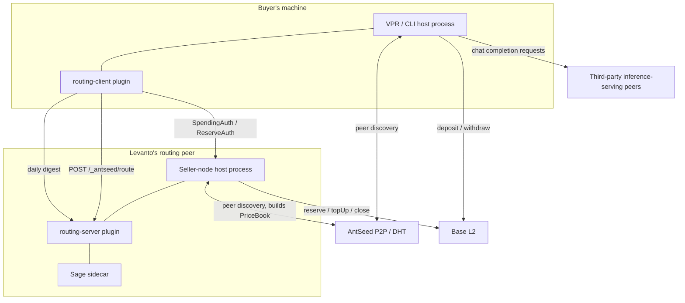

# Model Routing — System Architecture

**Ground truth:** `docs/model-routing-architecture-and-open-decisions.md`. Companion to `docs/model-routing-software-architecture.md` — that doc describes the code; this one describes the deployed, operating pieces: who runs what, where, and what talks to what.

---

## Components

### Buyer's VPR/CLI host process

Runs on the buyer's own machine — one instance per user. This is AntSeed's own core client code, not Levanto's: `AntseedNode` (P2P networking, peer discovery), `buyer-proxy` (the local HTTP proxy every chat request actually hits), and `BuyerPaymentManager`, which holds the buyer's real signing key and does all cryptographic signing for the buyer side. Everything the buyer's client does — routed or not — ultimately runs through this process.

### `routing-client` plugin

Loaded into the buyer's host process, not a separate process — but a separate piece of code from it, potentially written by a third party (decisions doc §G3: anyone can ship a competing router). Owns the new-user-message gate, the cached-token estimator, the local `routing_decisions` ledger, the daily pay-first signing decision, and sending the daily digest. Never holds the buyer's real signing key directly, even though it runs in the same process — it calls a narrow method on `BuyerPaymentManager` instead (software doc §2.6).

### AntSeed P2P / DHT

The discovery substrate every peer — buyer, routing peer, and inference sellers alike — talks over to find each other. Not itself operated by any one party in this system; bootstrap nodes for initial discovery are AntSeed's own infra (this specific claim not yet re-verified against code this pass, worth confirming).

### Levanto's routing peer (host process)

One or more server instances, operated by Levanto. Structurally an ordinary AntSeed seller node — `SellerPaymentManager`, `PaymentMux`, request dispatch — the same generic seller infrastructure any AntSeed seller runs, just with no inference-serving `Provider` plugin registered.

### `routing-server` plugin

Loaded into the routing peer's host process. Unlike `routing-client`, this one genuinely is Levanto's own code, not third-party. Owns the reserved-path `/_antseed/route` handler, the subscription gate (checks today's `SpendingAuth` is on file before doing any real work), and receiving the daily digest.

### Sage sidecar

A separate Python process, co-located with the routing peer but not the same process as `routing-server` — communicates with it locally. Does the actual ranking computation and holds Levanto's real IP: the Sage artifacts and training data. Lives in its own, separate Levanto-owned repo (decisions doc §9.6), not in `antseed-fork` at all — it's the one component in this whole system that isn't even open-source alongside the rest.

### Base L2

The blockchain AntSeed's payment contracts (`AntseedChannels`, `AntseedDeposits`) live on. External to everyone in this system — not operated by the buyer, Levanto, or AntSeed itself, just a shared dependency everyone transacts against. Buyers interact with it directly for depositing/withdrawing their own custody balance; the routing peer interacts with it for channel lifecycle calls (`reserve`/`topUp`/`close`), paying the gas each time.

### Third-party inference-serving peers

Many, independently operated by arbitrary sellers — not Levanto, not the buyer, not AntSeed. The actual nodes that run AI models and answer real chat completion requests. These are who the buyer's failover walk (software doc §2.4) dispatches to once the routing peer has picked a ranked list.

---

## Component Map

